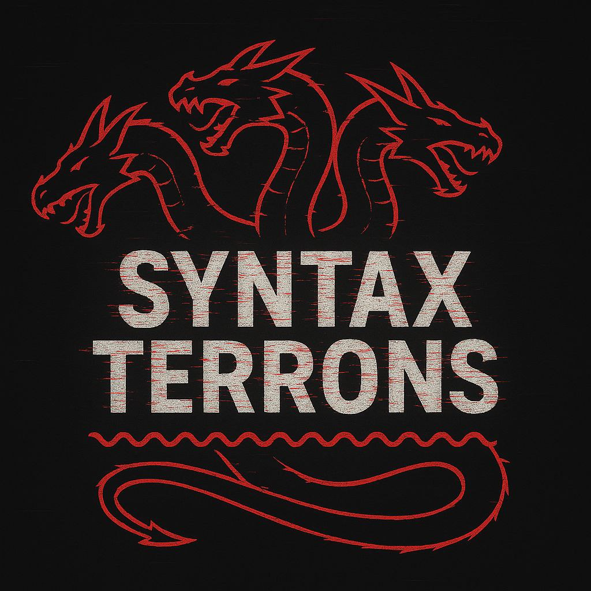

  🌐 Language: 
  <a href="README.md">🇮🇹 Italiano</a> | 
  <a href="README.en.md">🇬🇧 English</a>

# 🚩 CTF Writeups - GreyHat's pwn writeups.

> - Qui raccolgo tutto quello che combino durante le **CTF** in team e singleplayer: writeup, exploit, pony.  
> - Mi occupo di pwn e reversing, quindi se sei qui, sai cosa troverai.  
> - Lasciate ogni speranza o voi che entrate.  
> - In caso di problematiche con la repo o le sue funzioni, [contattami](https://youtu.be/xvFZjo5PgG0?si=fHpPpKrQBXCy53fA)

   
  <i>parte dei fondatori del team SyntaxTerrons e fiero partecipante</i>

---

## 📂 Com’è organizzata la repo?

- Ogni CTF ha la sua cartella.  
- Dentro trovi sottocartelle con il nome della challenge.
- In caso di categorie diverse, troverai le challenge sotto la cartella con il nome della categoria.
- A volte ci sono script puliti, a volte pezzi di codice scritti alle 3 di notte.
- Alcuni codici sono ancora sporchi di caffe'.
- Esegui gli script ad occhi chiusi. In questa maniera il fallimento e successo coesistono.

---

## 🔧 🧰 Tools che uso

- **[Sublime Text 3](https://www.sublimetext.com/3)**: editor per gli script.
- **[radare2](https://www.radare.org/r/)**: debugger per analisi dinamica.
- **[Ghidra](https://ghidra-sre.org/)**: decompilatore per analisi statica.
- **[Python 3](https://www.python.org/)**: linguaggio di programmazione per produrre script.
- **[pwntools](https://docs.pwntools.com/en/stable/)**: libreria Python e kit di tools per pwn e reversing.
- **[pwninit](https://github.com/io12/pwninit)**: util con patchelf per correggere il linking dei binari e produrre template in pwntools.
- Insonnia.
- Acqua.

Nella root trovi la cartella **tools**, in cui risiede il template di pwninit che uso.

---
## 🎯 Perché lo faccio?

- Mi annoio.
- Salvo le soluzioni prima che il computer possa scoppiare.
- Passo le mie conoscenze alle povere anime che seguono la mia stessa strada, in modo che possano soffrire di meno.
- Oppure spaventarli abbastanza per salvarli da questa strada di sofferenze binarie.

---

## ⚠️ Disclaimer

Tutto quello che trovi qui è solo a scopo **educativo e ludico**.  
Non fare il furbo.

---

## 🤝 Vuoi contribuire?

- Forka la repo
- Aggiungi la tua writeup o migliora le presenti (tipo correggere gli orrori di ortografia)  
- Manda una Pull Request
- Intraprendi un viaggio per scoprire te stesso
- Nel mentre che viaggi potrei accorgemene ed accettarlo

---

## 📫 Contattami

No.
